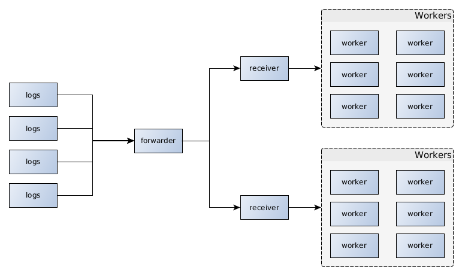

.. zerolog documentation master file, created by
   sphinx-quickstart on Fri Jul 15 22:42:02 2016.
   You can adapt this file completely to your liking, but it should at least
   contain the root `toctree` directive.

Zerolog documentation
=====================

Zerolog is a very simple python library designed to help you capture logs in realtime
from multiples sources sending log over TCP (rsyslog, syslog-ng, etc.) and process them
as you want for your needs

It will remain pretty simple and only provide you basics tools to capture log and process them for your needs, plus CLI tool to start all elements. Those elements are :

* A forwarder, who listen to incoming log and publish them
* A receiver, receiving messages from forwarder, and pass them to workers
* A worker, that process messages for you need

Installation
------------

You can install the project from source

.. code-block:: bash

   pip install -r requirements.txt
   python setup.py install

Contents:

.. toctree::
   :maxdepth: 1

   running_elements
   receiver_logging
   creating_workers
   using_supervisor
   commands_reference
   api

